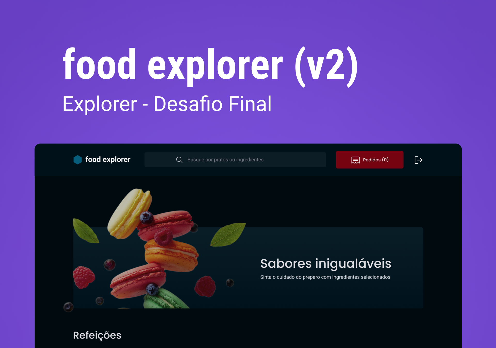

# Food Explorer



<br><br/>

> Projeto desenvolvido como desafio final para certificação da trilha Explorer da <a href='https://github.com/Rocketseat'>Rocketseat</a>.

## 💻 Pré-requisitos

Antes de começar, verifique se você atendeu aos seguintes requisitos:

- Você instalou a versão mais recente do `<nodejs>` que pode ser encontrada <a href='https://nodejs.org/en'>aqui</a>.
- Você tem uma máquina `<Windows / Linux / Mac>`.
- Crie o arquivo `.env` de acordo com o `.env.example`.

## 🚀 Instalando Food Explorer

Para instalar as dependências do Food Explorer, siga estas etapas:

Linux, Windows e macOS:

```
npm install
```

## ☕ Usando Food Explorer

Para usar Food Explorer, siga estas etapas:

- Executar a API do projeto seguindo as instruções da documentação que pode ser encontrada <a href='https://github.com/SergioRSanchez/food-explorer-api'>aqui</a>.
- Executar o projeto
```
npm run dev
```
- O projeto já contém alguns pratos e usuários cadastrados caso queira utilizar:
```
email: admin@email.com
senha: admin
```
```
email: customer@email.com
senha: customer
```
- Você pode conferir a live do projeto e utilizar os dados acima mencionados clicando <a href='https://food-explorer-website.netlify.app/'>aqui</a>!

## 🤝 Contato
<a href='mailto:ssanchezfilho@gmail.com'></a>
<a href='https://www.linkedin.com/in/sergio-roberto-sanchez-filho/' target='_blank'></a>